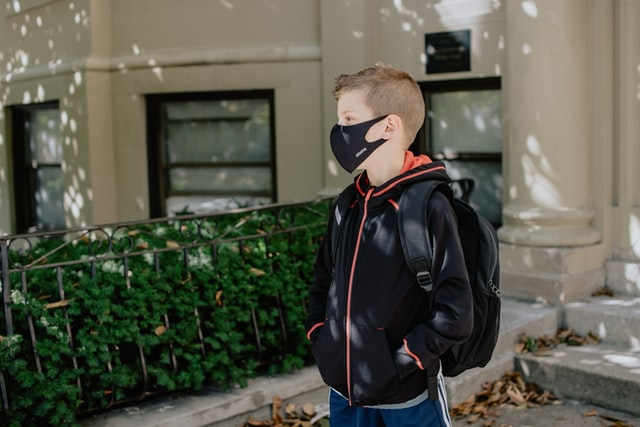

# Analyzing Tweets on K-12 Education During the COVID-19 Pandemic (Work in Progress)


Prepared and presented by: [Leah Pope](https://www.linkedin.com/in/leahspope/)

Presentation: [Coming Soon]()

Blog: [Coming Soon on Medium](https://leahspope7.medium.com/)



<span>Photo by <a href="https://unsplash.com/@kellysikkema?utm_source=unsplash&amp;utm_medium=referral&amp;utm_content=creditCopyText">Kelly Sikkema</a> on <a href="https://unsplash.com/s/photos/school-mask?utm_source=unsplash&amp;utm_medium=referral&amp;utm_content=creditCopyText">Unsplash</a></span>


# Introduction
COVID-19 has impacted the world in a multitude of ways. Some of the most striking and wide-reaching effects in the United States occurred within K-12 education. 

This project uses data collected from Twitter to explore the question "What is public sentiment in the United States on K-12 education during the COVID-19 pandemic?".


Applying Natural Language Processing and Supervised Machine Learning, I first created a text classifier to predict Tweet sentiment (Positive, Negative, or Neutral). Next I applied Unsupervised Machine Learning to identify topics within these different sentiment groups.


# Data Description and Preparation
I collected data from Twitter using [Tweepy](https://github.com/tweepy) and used previously collected Twitter data from the [Tweets about distance learning](https://www.kaggle.com/barishasdemir/tweets-about-distance-learning) dataset shared on Kaggle.

Positive, Negative, and Neutral sentiment labels for the Tweets were obtained using a hybrid approach combining the [VADER](https://github.com/cjhutto/vaderSentiment) and [Text Blob](https://github.com/sloria/textblob) sentiment tools with (limited) human labeling. 

X Tweets made it to the final project dataset after combining the Kaggle and collected Tweets, filtering out non-US locations, and dropping Tweets where the Sentiment Tools did NOT agree.

See the [Data Prep Notebook](./code/nb1_data_prep.ipynb) for additional information on data collection and preparation. 


# Topics Deep Dive
I wanted to take a closer look at the Topics modeled by LDA. Using [pyLDAvis](https://github.com/bmabey/pyLDAvis), I created interactive visualizations for various topic sets. 


# Sentiment Classifer Modeling
Coming Soon
<!-- 
In the [Model Experimentation Notebook](./code/nb4_model_playground.ipynb), I trained different multiclass classifers.  I used weighted F1 score as the performance metric, and ultimately selected the X model for further tuning.

In the [Final Model Notebook](./code/nb5_modeling.ipynb), I performed hyperparameter tuning using GridSearchCV, resulting in a multiclass classifer with the following performance:
* Weighted F1 score of __X.XX__ 

-->

# Recommendations
Coming Soon 
<!--
My recommendations are for the Education-focused Stakeholders identified in the Introduction.

### Recommendation 1
* Audience: Education-focused Stakeholders
* TBD

### Recommendation 2
* Audience: Education-focused Stakeholders
* TBD

### Recommendation 3
* Audience: Education-focused Stakeholders
* TBD

# Future Work
* Create a dashboard/app that would allow the user to select specific Regions and/or States for Topic Modeling. Also allow for setting the desired number of topics and top word count. 
* Create a dashboard/app to classify Tweets from the live Twitter stream. Allow the user to stream for Tweets for the entire United States, or selected US Region(s) or selected US State(s).
* Create a dashboard/app that would allow the user to select specific Regions and/or States for Topic Modeling. Also allow for setting the desired number of topics and top word count. 
* Identify specific Topics of interest and train a Text Classifier to classify Tweets according to those Topics. Consider Sentiment Classification after Tweet Topic has been determined.
    * For Example: Create a Text Classifer with Educators in mind.  Detect Tweets on Topics such as Online Teaching Resources, Participation/Engagment Tips for Online Learning, Teacher Professional Development, EdTech Products.
* Continue to collect Tweets over a longer timespan and update model.
* Improve the regex code used to detect a 'likely' United States location from the Tweet User-provided Location string.

# Repository Structure
```
--code
----nb1_data_prep.ipnyb (data prep)
----nb2_eda.ipynb (general EDA)
----nb3_corpus_eda.ipynb (topic modeling on the Tweet corpus)
----nb4_modeling_playground.ipynb  (experimentation on different modeling options)
----nb5_modeling.ipynb (final sentiment classifier modeling)
----demo_topic_viz.ipynb (interactive topic model visualization)
----demo_classifier.ipynb (get predictions from new Tweets)
----get_tweets.py (data collection)
----read_twitter_stream.py (data collection)
----extract_tweets_to_df.py (data collection/prep)
--data (dir for all data files ingested/generated)
--images (dir for images)
```
-->

# For More Information
* Contact the author [Leah Pope](https://www.linkedin.com/in/leahspope/)


